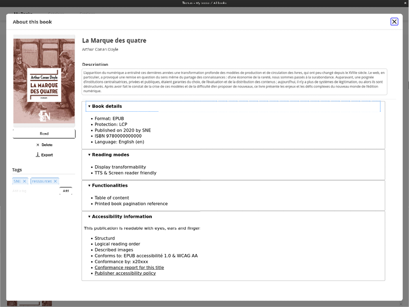
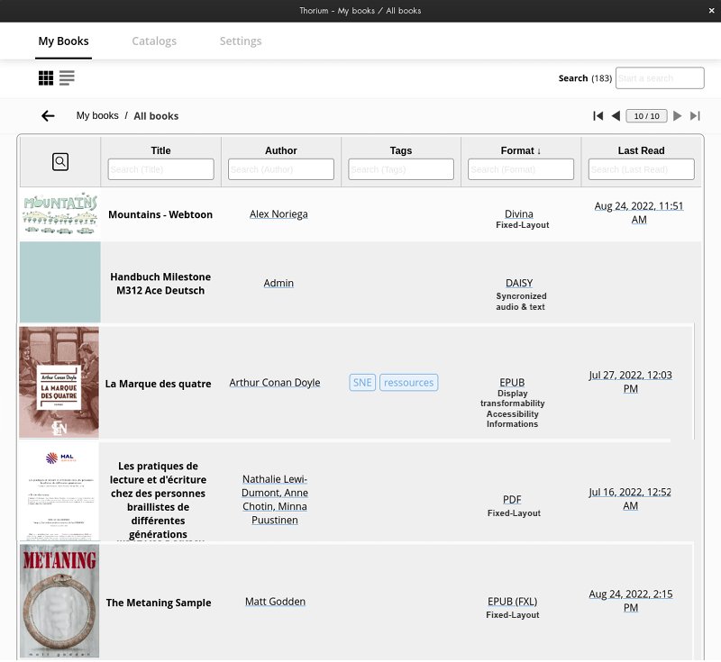

This proposal follows the [issue in Thorium-reader github: Display accessibility metadata and use it as a filter](https://github.com/edrlab/thorium-reader/issues/1332).

The subject is covered by accessibility task force of publishing community group at W3C and actually under active feedback from implementation projects in France, Canada, Italy at least.  See [references section](#references) for more context. 

This implementation proposal intent to be as complete as possible to help dealing with any recommandation change in the coming years.

1. If possible stretch Tag space to one or two lines. Or place it under the book action menu (read, delete, download). <!--User actions are on the left, information is on the right-->
2. Add `h2` level titles in a `details`/`summary`: **Book details, Reading modes, Functionalities, Accessibility Information, Hazard.** *A [code exemple in French](https://edition-accessible.github.io/signalement/protoype2/livre1.html) and [A code exemple in english](/livre1en.html) are proposed*.
3. populate the inside of `details` as unordered lists (`ul` / `li`) following the [mapping](#mapping) provided below. 

## filters

* reading mode 
  * Display transformability; 
  * Fixed-layout; 
  * TTS & Screen reader friendly;	
  * Text & audio synchronised
* accessibility information available

This may imply that reading mode and accessibility information available are displayed in the table of list view (All books). 

Another option may be to use the existing Format column and populate it with : fileFormat + readinGmode + accessibilityInfo

Alternatively a Man of Vitruve pictogram could be affected to any file claiming [conforms To WCAG AA](#conformsTo): 

## Mapping

[Readium Controled vocabulary : schema/a11y.schema.json
](https://github.com/readium/webpub-manifest/pull/85/files#diff-8cea754a027fe5af49d66d2c09ca919e926a884e447a290dbb71420c0c804f34)

### Book details
Elements actually displayed by thorium (book details) are not mapped but kept here for reference. 

|DisplayedEN|ReadiumJSON|fileMeta|ifNotPresent|
|---|---|---|---|
|Format: EPUB||||
|Protection: LCP||||
|Published on 2020 by SNE||||
|ISBN 9780000000000||||
|Language: English (en)||||

### Reading modes

If none of the information is provided, display : **No reading mode information available.** instead of *Reading modes*.
|DisplayedEN|ReadiumJSON|fileMeta|ifNotPresent|
|---|---|---|---|
|Display transformability|   "feature":" [context.jsonld#L21](https://github.com/readium/webpub-manifest/blob/8d3cd47a67b80d188143f6b92d83fb8665a01160/context.jsonld#L21) content="displayTransformability"|[schema.org:accessibilityFeature](http://schema.org/accessibilityFeature) content="displayTransformability"|ignore|
|Fixed-layout||*no existing value in schema.org. may be extracted from format (pdf + epub3FXL* In EPUB3 opf : rendition:layout property set to pre-paginated|ignore|
|Contents: text, audio, tactil, etc.|"accessMode":" [context.jsonld#L19](https://github.com/readium/webpub-manifest/blob/8d3cd47a67b80d188143f6b92d83fb8665a01160/context.jsonld#L19) [content="visual", "textual", "auditory", "tactil", etc.](https://github.com/readium/webpub-manifest/pull/85/files#diff-8cea754a027fe5af49d66d2c09ca919e926a884e447a290dbb71420c0c804f34#L55) (one line per value or coma separated values in one field) |[schema.org:accessMode](http://schema.org/accessMode)|ignore|
|TTS & Screen reader friendly | "accessModeSufficient" [context.jsonld#L20](https://github.com/readium/webpub-manifest/blob/8d3cd47a67b80d188143f6b92d83fb8665a01160/context.jsonld#L20): textual| [accessModeSufficient: textual](http://schema.org/accessModeSufficient)|ignore|
|Contenu audio intégral (présentation, index, notes)|"accessModeSufficient" [context.jsonld#L20](https://github.com/readium/webpub-manifest/blob/8d3cd47a67b80d188143f6b92d83fb8665a01160/context.jsonld#L20): auditory| schema.org:accessModeSufficient:auditory|ignore|
|Text & audio synchronised|"feature": [context.jsonld#L21](https://github.com/readium/webpub-manifest/blob/8d3cd47a67b80d188143f6b92d83fb8665a01160/context.jsonld#L19) content="synchronizedAudioText"|[schema.org:accessibilityFeature](http://schema.org/accessibilityFeature) [schema.org:sychronizedAudioText](https://www.w3.org/2021/a11y-discov-vocab/latest/#synchronizedAudioText)|ignore|

### Functionalities

If none of the information is provided: do not display.

|DisplayedEN|ReadiumJSON|fileMeta|ifNotPresent|
|---|---|---|---|
|Table of content|"feature": [context.jsonld#L21](https://github.com/readium/webpub-manifest/blob/8d3cd47a67b80d188143f6b92d83fb8665a01160/context.jsonld#L21) content="tableOfContents"|[schema.org:accessibilityFeature](http://schema.org/accessibilityFeature) [schema.org:tableOfContents](https://www.w3.org/2021/a11y-discov-vocab/latest/#tableOfContents)|ignore|
|Printed book pagination reference|"feature": [context.jsonld#L21](https://github.com/readium/webpub-manifest/blob/8d3cd47a67b80d188143f6b92d83fb8665a01160/context.jsonld#L21) content="printPageNumbers"|[schema.org:accessibilityFeature](http://schema.org/accessibilityFeature) [schema.org:printPageNumbers](https://www.w3.org/2021/a11y-discov-vocab/latest/#printPageNumbers)|ignore|

### Accessibility

If none of the information is provided, display : **No accessibility information available** instead of Accessibility informations.

|DisplayedEN|ReadiumJSON|fileMeta|ifNotPresent|
|---|---|---|---|
|any text ... lorem ipsum ... *[display content as it is, mark it with publication language lang tag - this item is not in a list element but in a `p`]*|"accessibilitySummary": [context.jsonld#L18](https://github.com/readium/webpub-manifest/blob/8d3cd47a67b80d188143f6b92d83fb8665a01160/context.jsonld#L18) content="any text ... lorem ipsum ..."|[schema.org:accessibilitySummary](http://schema.org/accessibilitySummary)|ignore|
|Structured|"feature": [context.jsonld#L21](https://github.com/readium/webpub-manifest/blob/8d3cd47a67b80d188143f6b92d83fb8665a01160/context.jsonld#L21) content="structural"|[schema:structural](https://www.w3.org/2021/a11y-discov-vocab/latest/#structuralNavigation)|ignore|
|Logical reading order|"feature": [context.jsonld#L21](https://github.com/readium/webpub-manifest/blob/8d3cd47a67b80d188143f6b92d83fb8665a01160/context.jsonld#L21) content="NavigationreadingOrder"|[schema:NavigationreadingOrder](https://www.w3.org/2021/a11y-discov-vocab/latest/#readingOrder)|ignore|
|Fully described graphical ressources|"feature": [context.jsonld#L21](https://github.com/readium/webpub-manifest/blob/8d3cd47a67b80d188143f6b92d83fb8665a01160/context.jsonld#L21) content="longDescription"|[schema.org:accessibilityFeature](http://schema.org/accessibilityFeature) [schema.org:longDescription](https://www.w3.org/2021/a11y-discov-vocab/latest/#longDescription)|ignore|
|<dt id="conformsTo">conformsTo</dt>: readable human text or URL *[display content as it is, mark it with publication language]* lang tag|"conformsTo": [context.jsonld#L7](https://github.com/readium/webpub-manifest/blob/8d3cd47a67b80d188143f6b92d83fb8665a01160/context.jsonld#L7) content="readable human text or URL"|[dc:conformsTo](http://purl.org/dc/terms/conformsTo"||No known conformity declared.|
|Conformance by: x20xxx *[display content as it is, mark it with publication language]*||[a11y:certifiedBy](https://www.w3.org/TR/epub-a11y-11/#certifiedBy)|ignore|
|<a href="ace-smart-report-fr.html">Conformance report</a> *[is a link]*||[dc:certifierReport](https://www.w3.org/TR/epub-a11y-11/#certifierReport)|ignore|
|<a href="infos-accessibilite-ed.html">Publisher accessibility policy</a> *[is a link]*||[(onix only)](https://ns.editeur.org/onix/en/196/96)|ignore|
|*Button:* Other informations available *open list of any schema.org:accessibilityFeature not yet parsed. Get [full controlled vocabulary](https://www.w3.org/2021/a11y-discov-vocab/latest/#accessibilityFeature-vocabulary) in locales (en.js, etc.) to be nammed later|"feature": [context.jsonld#L21](https://github.com/readium/webpub-manifest/blob/8d3cd47a67b80d188143f6b92d83fb8665a01160/context.jsonld#L21) content=any [controlled vocabulary](https://www.w3.org/2021/a11y-discov-vocab/latest/#accessibilityFeature-vocabulary) |[schema.org:accessibilityFeature](http://schema.org/accessibilityFeature) [schema.org:accessibilityFeature:controlled vocabulary](https://www.w3.org/2021/a11y-discov-vocab/latest/#accessibilityFeature-vocabulary) |ignore|

### Hazards
If none of the information is provided: do not display.

|DisplayedEN|ReadiumJSON|fileMeta|ifNotPresent|
|---|---|---|---|
|any of the following values: *flashing, motion simulation, sound, no flashing, no motion simulation, no sound, none, unknown.*|"hazard": [context.jsonld#L22](https://github.com/readium/webpub-manifest/blob/8d3cd47a67b80d188143f6b92d83fb8665a01160/context.jsonld#L22) content=any of the following values: *flashing, motion simulation, sound, no flashing, no motion simulation, no sound, none, unknown.*|[schema.org:accessibilityHazard](http://schema.org/accessibilityHazard) |ignore|

## References
- [User Experience Guide for Displaying Accessibility Metadata 1.0](https://www.w3.org/2021/09/UX-Guide-metadata-1.0/principles/)
- [French prototype for book sellers and libraries](https://edition-accessible.github.io/signalement/protoype2/livre1.html)
- [Display Techniques for EPUB Accessibility Metadata 1.0](https://www.w3.org/publishing/a11y/UX-Guide-metadata/techniques/epub-metadata/index.html)
- [partial Mapping with ONIX & MARC available in french.](https://edition-accessible.github.io/signalement/protoype2/references.html)
